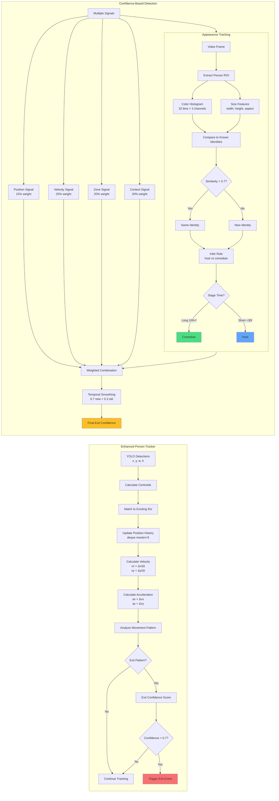
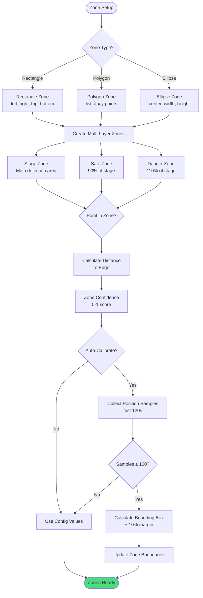
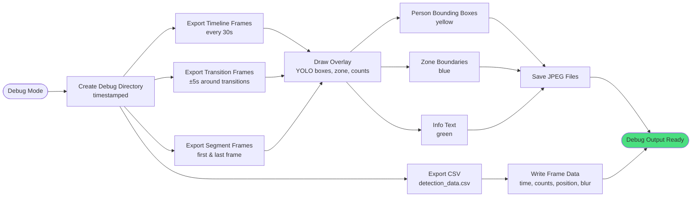

# Comedy Clipper Processing Pipeline

## Complete Processing Flow

```mermaid
flowchart TD
    Start([Start Processing]) --> LoadVideo[Load Video File]
    LoadVideo --> GetMetadata[Extract Video Metadata<br/>fps, duration, resolution]
    GetMetadata --> InitDetectors[Initialize Detectors]

    InitDetectors --> MediaPipe[MediaPipe<br/>Face + Pose]
    InitDetectors --> YOLO[YOLO v8<br/>Person Detection]
    InitDetectors --> Kalman[Kalman Filter<br/>Position Smoothing]

    MediaPipe --> FrameLoop{Process Each Frame<br/>sample_rate=30}
    YOLO --> FrameLoop
    Kalman --> FrameLoop

    FrameLoop -->|Every 30th frame| ReadFrame[Read Frame]
    ReadFrame --> RunDetection[Run All Detectors]

    RunDetection --> MediaPipeDet[MediaPipe Detection<br/>faces + poses]
    RunDetection --> YOLODet[YOLO Detection<br/>person bboxes]

    MediaPipeDet --> FaceCount[Count Faces]
    MediaPipeDet --> PoseCount[Count Poses<br/>max 1 person]

    YOLODet --> TrackPersons[Enhanced Person Tracker<br/>CentroidTracker]
    TrackPersons --> VelocityCalc[Calculate Velocity<br/>vx, vy per person]
    VelocityCalc --> ZoneCheck[Check Zone State<br/>inside/outside]

    ZoneCheck --> ZoneCrossing{Zone Crossing<br/>Detection}
    ZoneCrossing -->|Inside Stage| CountInside[Count Inside Zone]
    ZoneCrossing -->|Outside Stage| CountOutside[Count Outside Zone]

    CountInside --> PersonCountMethod{Person Count<br/>Method?}
    CountOutside --> PersonCountMethod
    FaceCount --> PersonCountMethod
    PoseCount --> PersonCountMethod

    PersonCountMethod -->|yolo_zone| UseZoneCount[Use YOLO Zone Count]
    PersonCountMethod -->|yolo| UseYOLOCount[Use All YOLO Count]
    PersonCountMethod -->|max| UseMaxCount[Use max faces, poses]
    PersonCountMethod -->|min| UseMinCount[Use min faces, poses]
    PersonCountMethod -->|hybrid| UseHybrid[Use YOLO if available<br/>else max]

    UseZoneCount --> FinalCount[Final Person Count]
    UseYOLOCount --> FinalCount
    UseMaxCount --> FinalCount
    UseMinCount --> FinalCount
    UseHybrid --> FinalCount

    FinalCount --> StoreHistory[Store in Detection History]
    StoreHistory --> NextFrame{More Frames?}

    NextFrame -->|Yes| FrameLoop
    NextFrame -->|No| ProcessHistory[Process Detection History]

    ProcessHistory --> Smoothing[Apply Median Smoothing<br/>window=7 frames]
    Smoothing --> TransitionAnalysis[Analyze Transitions]

    TransitionAnalysis --> CheckRules{Check Transition<br/>Rules}

    CheckRules -->|2→1| Rule1[Host exits<br/>START SEGMENT]
    CheckRules -->|1→2| Rule2[Host enters<br/>END SEGMENT]
    CheckRules -->|0→1| Rule3[Comedian enters<br/>START SEGMENT]
    CheckRules -->|1→0| Rule4[Comedian exits<br/>END SEGMENT]

    Rule1 --> CheckStability{Count stable<br/>for N frames?}
    Rule2 --> CheckStability
    Rule3 --> CheckStability
    Rule4 --> CheckStability

    CheckStability -->|Yes N≥5| RecordTransition[Record Transition]
    CheckStability -->|No| IgnoreFlicker[Ignore Flicker]

    RecordTransition --> SegmentList[Build Segment List]
    IgnoreFlicker --> TransitionAnalysis

    SegmentList --> FilterSegments[Filter Segments]
    FilterSegments --> MinDuration{Duration ≥<br/>min_duration?}

    MinDuration -->|Yes ≥15s| KeepSegment[Keep Segment]
    MinDuration -->|No| DiscardSegment[Discard Segment]

    KeepSegment --> AddBuffers[Add Time Buffers<br/>-5s before, +5s after]
    AddBuffers --> ValidSegments[Valid Segments List]

    ValidSegments --> ExportClips{Export Clips?}
    ExportClips -->|Yes| FFmpegExport[FFmpeg Extract Clips]
    ExportClips -->|No| ReturnResults[Return Segment Info]

    FFmpegExport --> SaveClips[Save Clip Files]
    SaveClips --> DebugFrames{Debug Mode?}

    DebugFrames -->|Yes| ExportDebug[Export Debug Frames<br/>CSV + Images]
    DebugFrames -->|No| Complete

    ExportDebug --> Complete([Processing Complete])
    ReturnResults --> Complete

    style Start fill:#4ade80
    style Complete fill:#4ade80
    style FinalCount fill:#fbbf24
    style CheckStability fill:#f87171
    style PersonCountMethod fill:#60a5fa
```



## Enhanced Detection Layer (New Features)



## Zone Configuration Flow



## Debug Output Flow



## Current Issue Analysis

Based on the debug frames and CSV data, here's what's happening:

### Problem Identified

```
Frame 0:   person_count=2  (but YOLO: Inside=2, Outside=1 = 3 total)
Frame 449: person_count=2  (shown in image as 1 person)
```

**The person count is stuck at 2 throughout the entire video!**

This is why no segments are detected - the transition analysis needs the person count to CHANGE (2→1, 1→2, etc.) but it never does.

### Root Cause

Looking at the CSV data:
- `num_faces` varies: 1-3
- `num_poses` always: 1 (MediaPipe limitation - only tracks 1 person)
- `person_count` always: 2

The person count is likely being calculated as:
```python
person_count_method = "max"  # or similar
person_count = max(num_faces, num_poses)
```

But it should be using:
```python
person_count_method = "yolo_zone"
person_count = yolo_person_count_inside  # from zone crossing
```

### Solution

The config says `person_count_method: yolo_zone` but the actual count being used appears to be from MediaPipe (max of faces/poses), not from YOLO zone detection.

Need to verify the person count calculation is actually using the YOLO zone count from the enhanced tracker!
